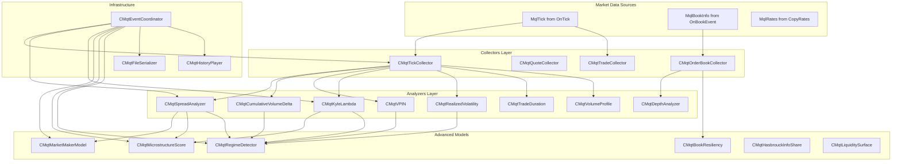
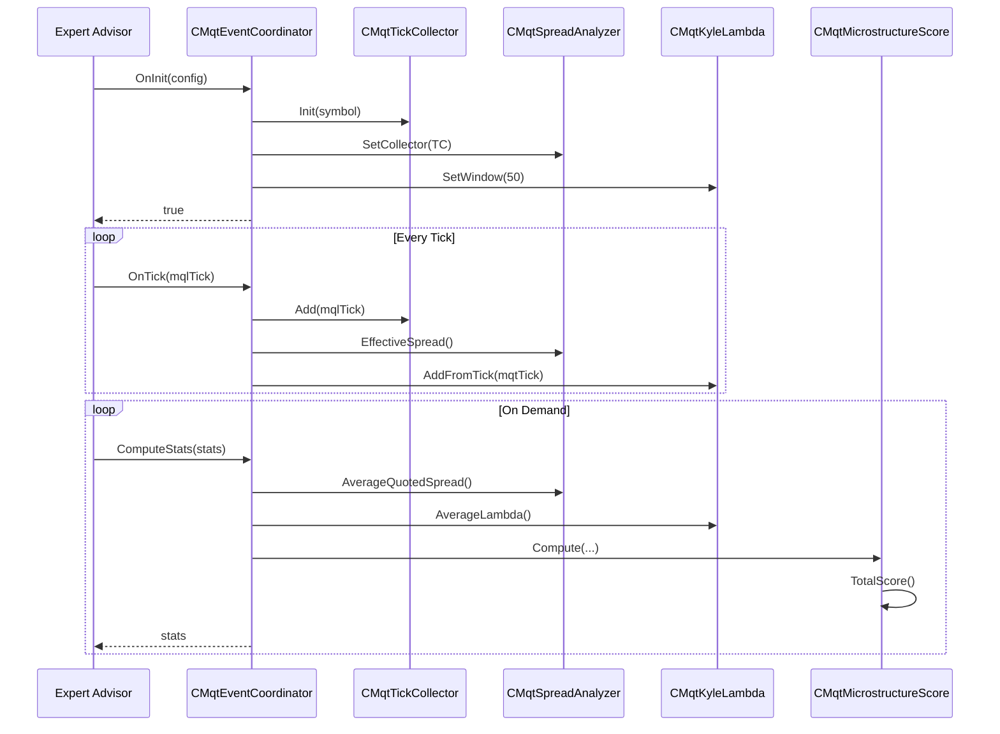
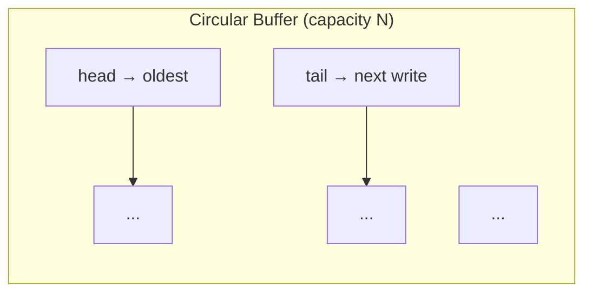
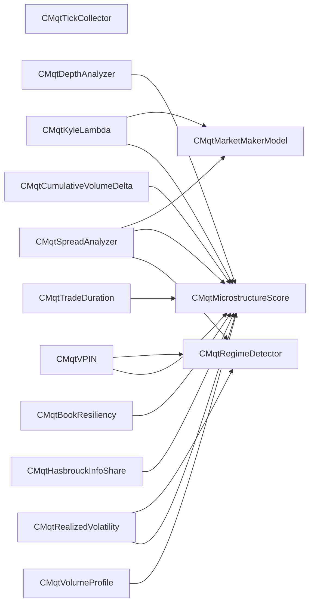
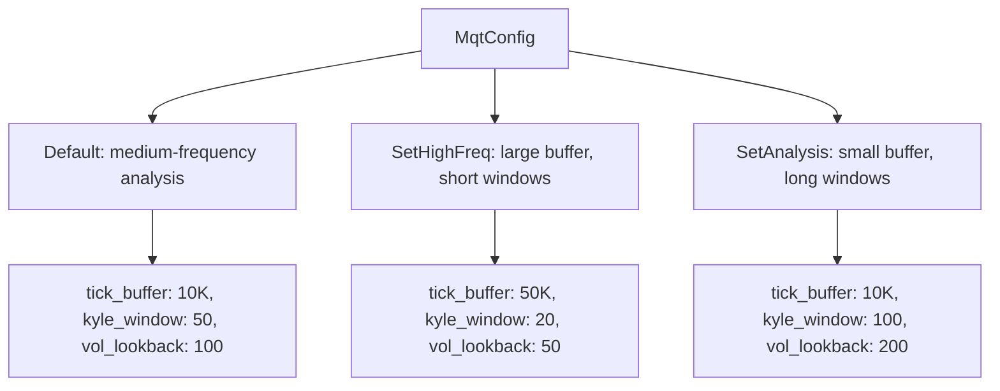

# Architecture

This document describes the design, data flow, and component relationships of the MQT market microstructure analysis library.

---

## Overview

MQT is an **event-driven, modular** library organised as a pipeline:

```
Market Data (ticks, quotes, DOM)
        │
        ▼
  ┌─ Collectors ──┐    Circular buffers, flag-based classification
        │
        ▼
  ┌─ Analyzers ───┐    Liquidity, Order Flow, Impact, Volatility, etc.
        │
        ▼
  ┌─ Models ──────┐    Composite scores, regime detection, spread decomposition
        │
        ▼
  ┌─ Coordinator ─┐    Event routing, lifecycle, serialization
```

All modules are **optional** — enable only what you need via the `active_modules` bitmask in `MqtConfig`.

---

## Data Flow



---

## Event-Driven Design

The `CMqtEventCoordinator` is the central hub. It owns (or is given) pointers to all modules and routes MQL5 events:



---

## Circular Buffer Design

Every collector uses a **fixed-capacity circular buffer** with O(1) push and automatic eviction of the oldest element on overflow.



Key properties:

| Property | Behaviour |
|----------|-----------|
| **Push** `Add()` | Writes at `tail`, advances `tail = (tail+1) % N`. If `count == N`, advances `head` (drops oldest). |
| **Read** `GetAt(i)` | Returns element at `(head + i) % N` for `0 <= i < count`. |
| **Eviction** | Silent — no callback by default. Use `MqtOverflowCallback` via `SetOverflowCallback()` to detect drops. |
| **Count** | `Count()` returns the number of valid elements (`0..N`). |

---

## Module Dependency Graph



Dependencies flow **upward**: Collectors have no dependencies on analyzers. Analyzers depend only on collector data (or on other analyzers for composite models). The `CMqtEventCoordinator` wires everything together and has visibility of all modules.

---

## Configuration System

`MqtConfig` uses a flat struct with safe defaults. Two preset methods override groups of fields:



Module selection:
```mermaid
flowchart LR
    CFG[MqtConfig.active_modules]
    CFG --> FLAGS[MQT_MODULE_TICK_COLLECTOR | MQT_MODULE_KYLE | ...]

    FLAGS --> AND{bitwise AND}
    AND -->|nonzero| INIT[Module initialised]
    AND -->|zero| SKIP[Module skipped]
```

---

## Serialization Format

Binary files use a simple header + payload format:

```
┌──────────────────────────────┐
│  Magic: 0x4D535400 (4 bytes) │
│  Version: 1 (4 bytes)        │
├──────────────────────────────┤
│  Stats or Snapshot payload   │
│  (variable length)           │
└──────────────────────────────┘
```

All `time_msc` and `volume` fields use 8-byte writes (`FileWriteLong`/`FileReadLong`) to avoid the 4-byte truncation bug in `FileWriteInteger`.
