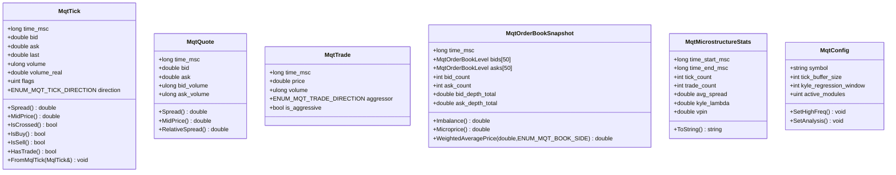
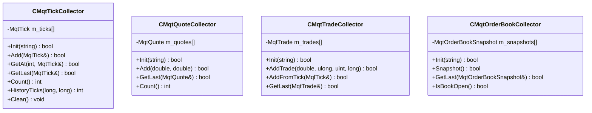
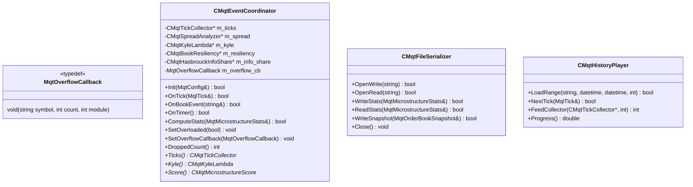
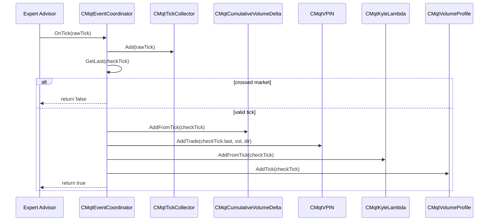
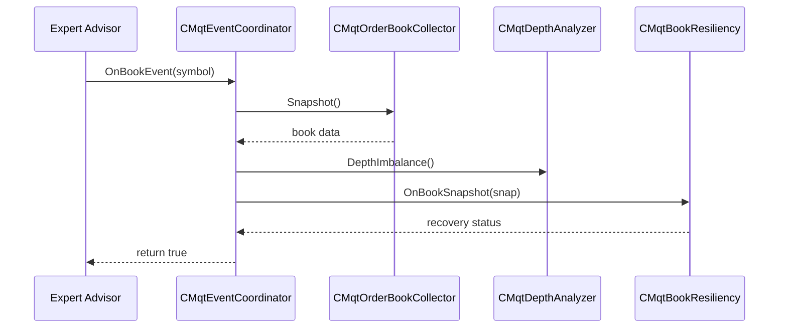

# UML Diagrams

This document provides class hierarchy, component, and sequence diagrams using Mermaid notation.

---

## Class Hierarchy — Core Data Types



---

## Collectors Hierarchy



---

## Analyzers Hierarchy

```mermaid
classDiagram
    class CMqtSpreadAnalyzer {
        -CMqtTickCollector* m_tick_collector
        +SetCollector(CMqtTickCollector*) void
        +QuotedSpread() double
        +EffectiveSpread() double
        +AverageQuotedSpread(int) double
        +AverageEffectiveSpread(int) double
    }

    class CMqtDepthAnalyzer {
        -CMqtOrderBookCollector* m_book_collector
        +SetCollector(CMqtOrderBookCollector*) void
        +TotalBidDepth() double
        +TotalAskDepth() double
        +DepthImbalance() double
        +WeightedAveragePrice(double) double
    }

    class CMqtCumulativeVolumeDelta {
        +AddFromTick(MqtTick&) bool
        +Cumulative() double
        +Delta(int) double
        +DeltaRatio(int) double
        +ZScore(int) double
    }

    class CMqtVPIN {
        +InitAdaptive(string, int) void
        +AddTrade(double, ulong, ENUM_MQT_TICK_DIRECTION) bool
        +CurrentVPIN() double
        +AverageVPIN(int) double
        +IsToxic(int, double) bool
    }

    class CMqtKyleLambda {
        +SetWindow(int) void
        +SetThrottle(int) void
        +AddFromTick(MqtTick&) bool
        +CurrentLambda() double
        +AverageLambda(int) double
    }

    class CMqtRealizedVolatility {
        +ComputeFromPrices(double[], int) double
        +ComputeParkinson(double[], double[], int) double
        +ComputeGarmanKlass(double[], double[], double[], double[], int) double
        +ComputeYangZhang(double[], double[], double[], double[], int) double
        +Average(int) double
    }

    class CMqtTradeDuration {
        +AddTrade(long) bool
        +AverageDuration(int) double
        +TradeIntensity(int) double
        +DurationAutocorr(int, int) double
    }

    class CMqtLeeReady {
        +Classify(double, ulong, double, double) ENUM_MQT_TRADE_DIRECTION
        +ClassifyMqlTick(MqlTick&) ENUM_MQT_TRADE_DIRECTION
        +Reset() void
    }
```



---

## Advanced Models Hierarchy

```mermaid
classDiagram
    class CMqtMarketMakerModel {
        +DecomposeSpread(CMqtSpreadAnalyzer*, CMqtKyleLambda*, int) bool
        +AdverseSelectionComponent() double
        +ProbabilityOfInformedTrading() double
    }

    class CMqtMicrostructureScore {
        +Compute(CMqtSpreadAnalyzer*, CMqtDepthAnalyzer*, ...) bool
        +TotalScore() double
        +Rating() string
    }

    class CMqtRegimeDetector {
        +Detect(CMqtSpreadAnalyzer*, CMqtRealizedVolatility*, ...) ENUM_MQT_MARKET_REGIME
        +IsStressRegime(CMqtSpreadAnalyzer*, CMqtRealizedVolatility*) bool
    }

    class CMqtBookResiliency {
        +SetBookCollector(CMqtOrderBookCollector*) void
        +OnTrade(long, double, ulong) bool
        +OnBookSnapshot(MqtOrderBookSnapshot&) bool
        +AverageResiliency(int) double
        +AverageRecoveryTime(int) double
    }

    class CMqtVolumeProfile {
        +InitAuto(string, int) bool
        +AddTrade(double, ulong) bool
        +VWAP() double
        +POCPrice() double
        +ValueAreaLow(double) double
        +ValueAreaHigh(double) double
        +Entropy() double
    }

    class CMqtHasbrouckInfoShare {
        +SetLags(int) void
        +Add(double, double) bool
        +InformationShare() double
        +PermanentImpact() double
    }
```



---

## Event Coordinator



---

## Sequence Diagram — Tick Processing



---

## Sequence Diagram — Book Event with Resiliency



---

## Package Diagram

```mermaid
packages
    package "Microstructure Library" {
        package "Collectors" {
            CMqtTickCollector
            CMqtQuoteCollector
            CMqtTradeCollector
            CMqtOrderBookCollector
        }
        package "Analyzers" {
            CMqtSpreadAnalyzer
            CMqtDepthAnalyzer
            CMqtCumulativeVolumeDelta
            CMqtOrderFlowImbalance
            CMqtVPIN
            CMqtKyleLambda
            CMqtAmihudIlliquidity
            CMqtRealizedVolatility
            CMqtMicrostructureNoise
            CMqtTradeDuration
            CMqtACDModel
            CMqtLeeReady
            CMqtTickRule
        }
        package "Models" {
            CMqtMarketMakerModel
            CMqtMicrostructureScore
            CMqtRegimeDetector
            CMqtBookResiliency
            CMqtVolumeProfile
            CMqtHasbrouckInfoShare
        }
        package "Infrastructure" {
            CMqtEventCoordinator
            CMqtFileSerializer
            CMqtHistoryPlayer
            CMqtTickAggregator
        }
    }
```
